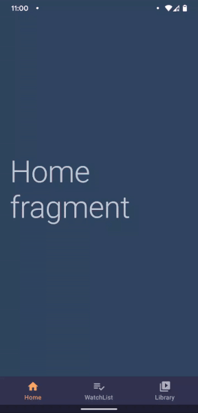

# Fab-Reveal Fragment Transaction

A sample to show how to create a morph like Fab-Reveal animation during fragment transaction.

When you click on the `FloatingActionButton` it will run a _morph_ like animation which seems like FAB is transforming into another screen (fragment). Check the [sample app](/art) to see it in action.

<>



<>

Apart from animation this sample also focus on the correct way to implement `BottomNavigation` in an `Activity` using pure fragment transaction, maintaining backstack & also handling configuration change.

There is class `AbstractBottomNavActivity` which abstracts away this implementation so suppose in future you want to switch to some 3rd party solution it wouldn't be difficult to do so.

<!-- ## Resources
TODO:
- [Fragment transactions with Fab-Reveal animation](/add-here) - A detailed article explaining how to achieve this animation. -->

## License

- [The Apache License Version 2.0](https://www.apache.org/licenses/LICENSE-2.0.txt)

```
Copyright 2021 Kaustubh Patange

Licensed under the Apache License, Version 2.0 (the "License");
you may not use this file except in compliance with the License.
You may obtain a copy of the License at

   https://www.apache.org/licenses/LICENSE-2.0

Unless required by applicable law or agreed to in writing, software
distributed under the License is distributed on an "AS IS" BASIS,
WITHOUT WARRANTIES OR CONDITIONS OF ANY KIND, either express or implied.
See the License for the specific language governing permissions and
limitations under the License.
```
