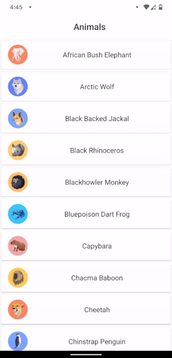

# Spring Back RecyclerView

A sample to show how we can implement a spring back functionality for Recyclerview.

When you fling the `RecyclerView` & it reaches either end or to the top of the list the remaining velocity will be dispersed to create this _Spring_ like animation.



_Animation is playing at 0.5x_

## Usage

This is not a library but a sample build for an article that I wrote on medium (see below). TBH, this is just my take on how the animation have been applied.

## Resources

- [Spring Back Recyclerview - The basics]() - An article explaining how to create this animation.

## License

- [The Apache License Version 2.0](https://www.apache.org/licenses/LICENSE-2.0.txt)

```
Copyright 2021 Kaustubh Patange

Licensed under the Apache License, Version 2.0 (the "License");
you may not use this file except in compliance with the License.
You may obtain a copy of the License at

   https://www.apache.org/licenses/LICENSE-2.0

Unless required by applicable law or agreed to in writing, software
distributed under the License is distributed on an "AS IS" BASIS,
WITHOUT WARRANTIES OR CONDITIONS OF ANY KIND, either express or implied.
See the License for the specific language governing permissions and
limitations under the License.
```
